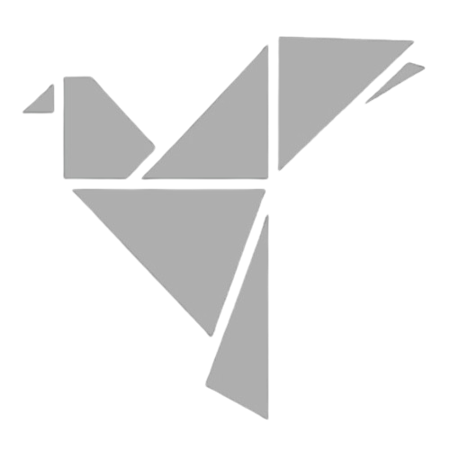

<a name="readme-top" id="readme-top"></a>

[![LinkedIn][linkedin-shield]][linkedin-url]
[![Instagram][Instagram-shield]][instagram-url]
[![Portfolio][portfolio-shield]][portfolio-url]

<!-- PROJECT LOGO -->
<br />
<div align="center">
  <a href="#">
    
  </a>

  <h3 align="center">Tech Innovate</h3>

  <p align="center">
    Pionir dalam menciptakan solusi teknologi yang revolusioner dan berkelanjutan.
    <br />
    <a href="https://tech-innovate-accenggg.netlify.app/"><strong>Explore the Website »</strong></a>
    <br />
    <br />
    <!-- <a href="https://github.com/othneildrew/Best-README-Template">View Demo</a>
    ·
    <a href="https://github.com/othneildrew/Best-README-Template/issues">Report Bug</a>
    ·
    <a href="https://github.com/othneildrew/Best-README-Template/issues">Request Feature</a> -->
  </p>
</div>

<!-- TABLE OF CONTENTS -->
<!-- <details>
  <summary>Table of Contents</summary>
  <ol>
    <li>
      <a href="#about-the-project">About The Project</a>
      <ul>
        <li><a href="#built-with">Built With</a></li>
      </ul>
    </li>
    <li>
      <a href="#getting-started">Getting Started</a>
      <ul>
        <li><a href="#prerequisites">Prerequisites</a></li>
        <li><a href="#installation">Installation</a></li>
      </ul>
    </li>
    <li><a href="#usage">Usage</a></li>
    <li><a href="#roadmap">Roadmap</a></li>
    <li><a href="#contributing">Contributing</a></li>
    <li><a href="#license">License</a></li>
    <li><a href="#contact">Contact</a></li>
    <li><a href="#acknowledgments">Acknowledgments</a></li>
  </ol>
</details> -->

<!-- ABOUT THE PROJECT -->

## Tentang TechInnovate

[![Product Name Screen Shot][product-screenshot]](https://tech-innovate-accenggg.netlify.app/)

TechInnovate adalah perusahaan teknologi inovatif yang berfokus pada pengembangan solusi digital yang revolusioner. Dengan tim ahli yang bersemangat, kami menyediakan layanan pembuatan website, pengembangan aplikasi mobile, dan berbagai solusi teknologi lainnya untuk memenuhi kebutuhan bisnis yang berkembang pesat. Kami memprioritaskan inovasi, kualitas, dan kepuasan pelanggan untuk membawa kemajuan teknologi yang berkelanjutan dan mendukung transformasi digital bagi masyarakat dan industri.

<p align="right">(<a href="#readme-top">back to top</a>)</p>

### Tech Stack

Projek ini menggunakan teknologi sebagai berikut:

- ![Html][Html]
- ![Css][Css]

<p align="right">(<a href="#readme-top">back to top</a>)</p>

<!-- GETTING STARTED -->

## Fitur

- Tampilan yang responsive
- Dapat digunakan kembali untuk projek lainnya
- Template gratis

### Cara Penggunaan

_Ikuti petunjuk dibawah untuk penggunaan program._

1. Clone repository
   ```sh
   git clone https://github.com/accenggg/TechInnovate-Landing-Page
   ```
2. Jalankan program
   ```sh
   klik kanan file index.html dan buka menggunakan browser
   ```

<p align="right">(<a href="#readme-top">back to top</a>)</p>

## Contact

Instagram - [@accenggg](https://instagram.com/accenggg)

<p align="right">(<a href="#readme-top">back to top</a>)</p>

<!-- ACKNOWLEDGMENTS -->

<!-- ## Acknowledgments

Use this space to list resources you find helpful and would like to give credit to. I've included a few of my favorites to kick things off!

- [Choose an Open Source License](https://choosealicense.com)
- [GitHub Emoji Cheat Sheet](https://www.webpagefx.com/tools/emoji-cheat-sheet)
- [Malven's Flexbox Cheatsheet](https://flexbox.malven.co/)
- [Malven's Grid Cheatsheet](https://grid.malven.co/)
- [Img Shields](https://shields.io)
- [GitHub Pages](https://pages.github.com)
- [Font Awesome](https://fontawesome.com)
- [React Icons](https://react-icons.github.io/react-icons/search)

<p align="right">(<a href="#readme-top">back to top</a>)</p> -->

<!-- MARKDOWN LINKS & IMAGES -->
<!-- https://www.markdownguide.org/basic-syntax/#reference-style-links -->

[instagram-shield]: https://img.shields.io/badge/Instagram-E4405F?style=for-the-badge&logo=instagram&logoColor=white
[instagram-url]: https://www.instagram.com/accenggg
[portfolio-shield]: https://img.shields.io/badge/Portfolio-255E63?style=for-the-badge&logo=About.me&logoColor=white
[portfolio-url]: https://michaelarselius.com/
[stars-shield]: https://img.shields.io/github/stars/othneildrew/Best-README-Template.svg?style=for-the-badge
[stars-url]: https://github.com/othneildrew/Best-README-Template/stargazers
[issues-shield]: https://img.shields.io/github/issues/othneildrew/Best-README-Template.svg?style=for-the-badge
[issues-url]: https://github.com/othneildrew/Best-README-Template/issues
[license-shield]: https://img.shields.io/github/license/othneildrew/Best-README-Template.svg?style=for-the-badge
[license-url]: https://github.com/othneildrew/Best-README-Template/blob/master/LICENSE.txt
[linkedin-shield]: https://img.shields.io/badge/-LinkedIn-black.svg?style=for-the-badge&logo=linkedin&colorB=555
[linkedin-url]: https://www.linkedin.com/in/michael-arselius-pamasi-240aa1278/
[product-screenshot]: images/preview-techinnovate.png
[Next-url]: https://nextjs.org/
[React.js]: https://img.shields.io/badge/React-20232A?style=for-the-badge&logo=react&logoColor=61DAFB
[React-url]: https://reactjs.org/
[Html]: https://img.shields.io/badge/HTML5-E34F26?style=for-the-badge&logo=html5&logoColor=white
[Css]: https://img.shields.io/badge/CSS3-1572B6?style=for-the-badge&logo=css3&logoColor=white
[Vue.js]: https://img.shields.io/badge/Vue.js-35495E?style=for-the-badge&logo=vuedotjs&logoColor=4FC08D
[Vue-url]: https://vuejs.org/
[Angular.io]: https://img.shields.io/badge/Angular-DD0031?style=for-the-badge&logo=angular&logoColor=white
[Angular-url]: https://angular.io/
[Svelte.dev]: https://img.shields.io/badge/Svelte-4A4A55?style=for-the-badge&logo=svelte&logoColor=FF3E00
[Svelte-url]: https://svelte.dev/
[Laravel.com]: https://img.shields.io/badge/Laravel-FF2D20?style=for-the-badge&logo=laravel&logoColor=white
[Laravel-url]: https://laravel.com
[Bootstrap.com]: https://img.shields.io/badge/Bootstrap-563D7C?style=for-the-badge&logo=bootstrap&logoColor=white
[Bootstrap-url]: https://getbootstrap.com
[JQuery.com]: https://img.shields.io/badge/jQuery-0769AD?style=for-the-badge&logo=jquery&logoColor=white
[JQuery-url]: https://jquery.com
